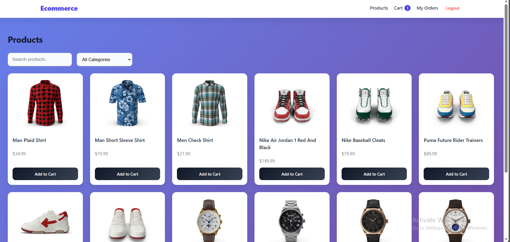
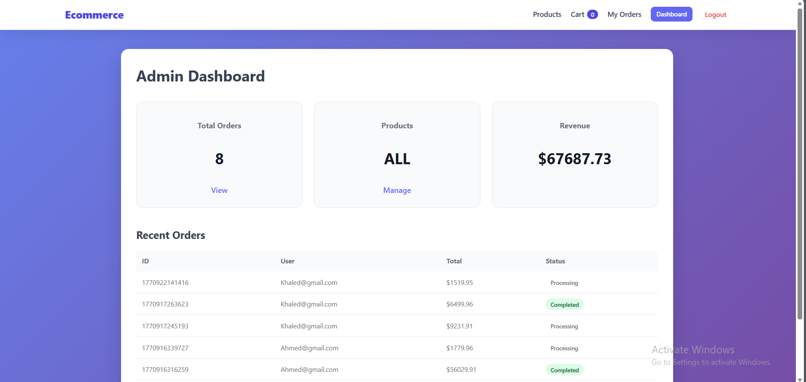
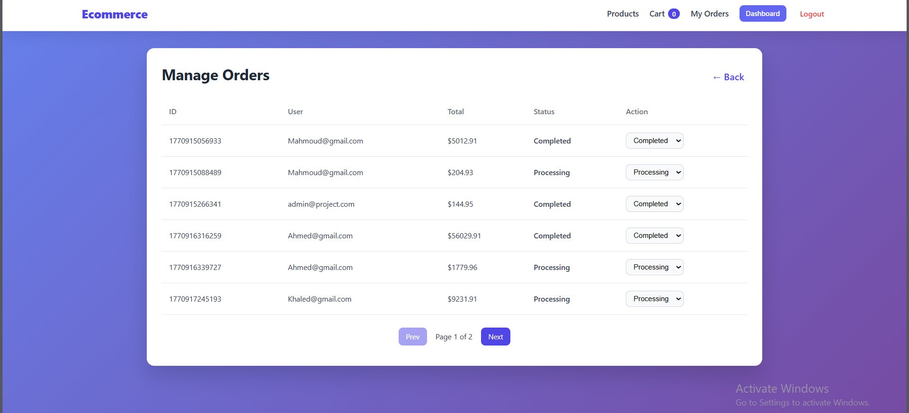
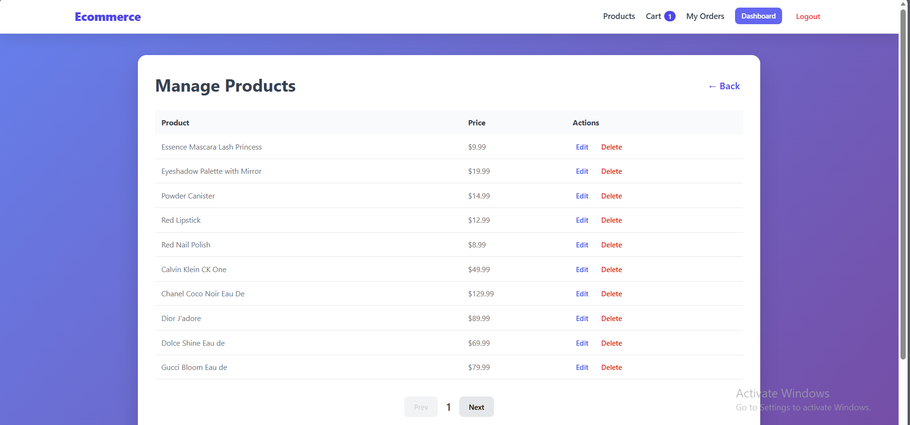
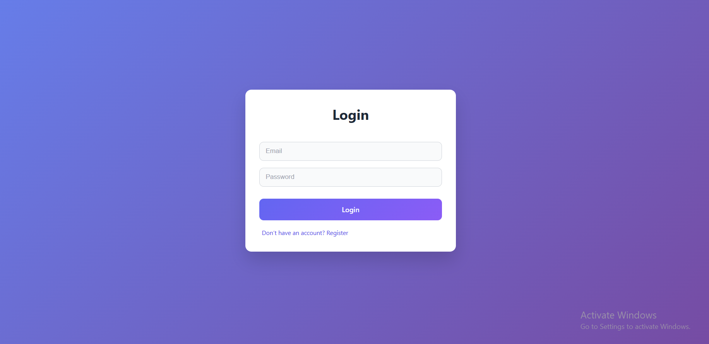

# 🛒 React E-Commerce Frontend

A modern and scalable e-commerce frontend application built with React.js.  
This project focuses on frontend architecture, state management, and API integration using mock REST APIs.

---

## 🚀 Live Features

- 🔐 Authentication (Login / Register)
- 👤 Role-Based Access (User / Admin)
- 🛠 Admin Dashboard
- 🔒 Protected Routes
- 🛍 Product Listing & Details
- 🛒 Shopping Cart with Persistent Storage
- 📦 Orders Page
- 📱 Responsive UI

---

## 🏗 Tech Stack

- **React.js**
- **Redux Toolkit** (Global State Management)
- **React Query** (Server-State Management & Caching)
- **React Router**
- **TailwindCSS**
- **CSS Modules**

---

## 🧠 Architecture Highlights

- Feature-based folder structure
- Separation of client-state and server-state
- Role-based route protection
- Persistent cart using localStorage
- Reusable component design

## ⚙️ Installation

```bash
git clone https://github.com/Karim-Mohamed20/E-Commerce.git
cd your-repo-name
npm install
npm run dev
```

## 📸 Screenshots

### 🏠 Home Page


### 🛍 Product Details Page


### 🛒 Cart Page


### 🛒 Checkout Page


### 📦 Orders Page


### 🛠 Admin Dashboard Page


### 📦 Manage Orders Page


### 🛍 Manage Products Page


### 🔐 Register Page


### 🔐 Login Page

