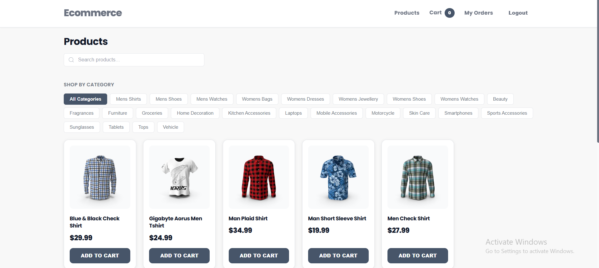
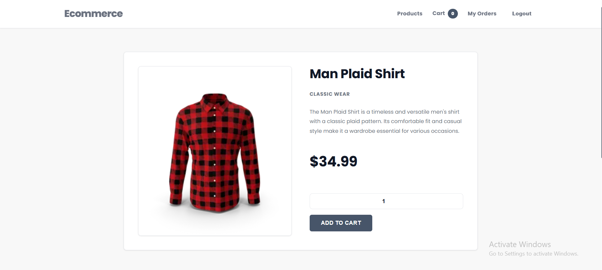
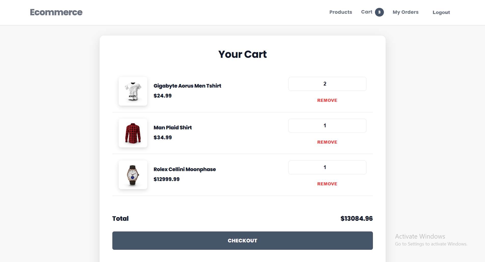
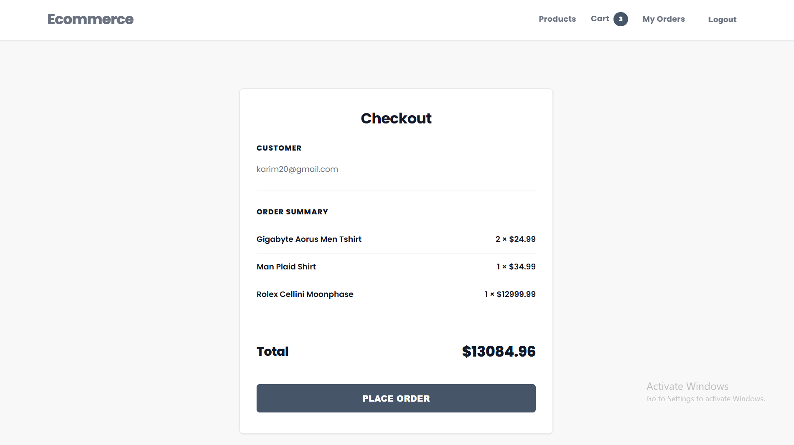
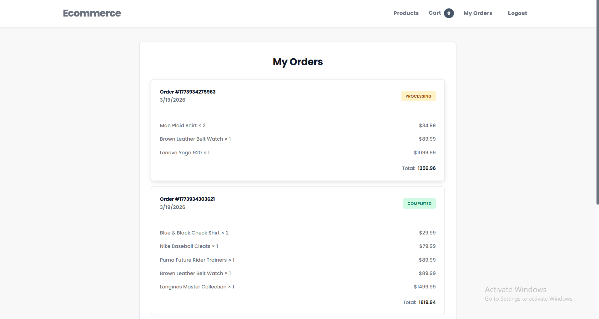
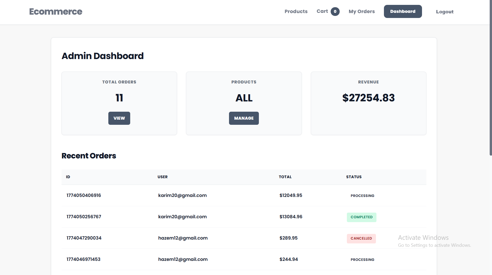
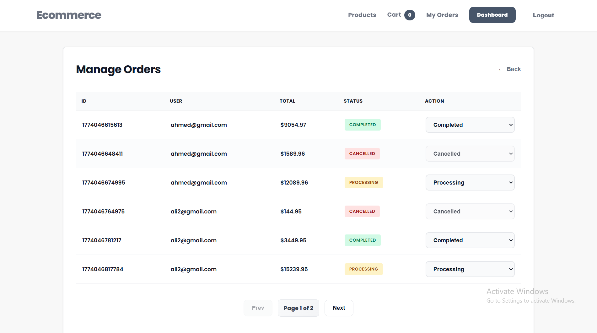
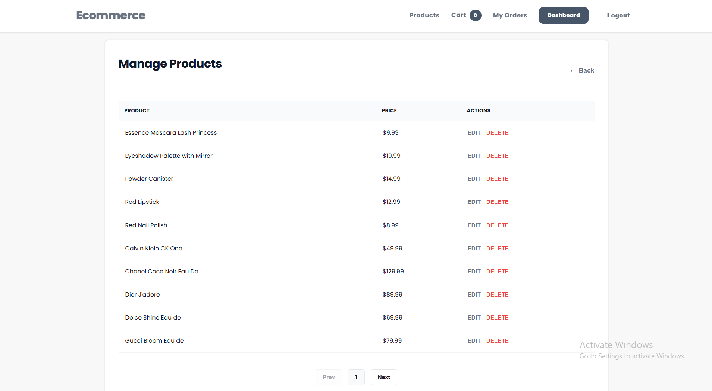
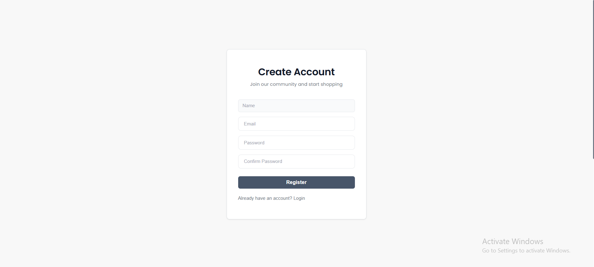
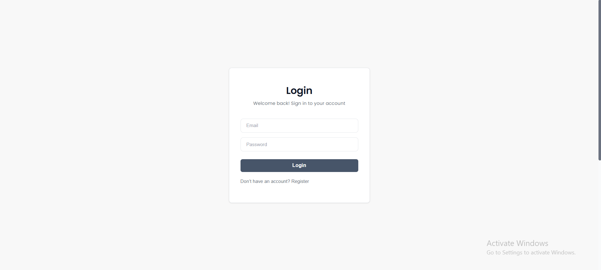

# 🛒 React E-Commerce Frontend

A modern e-commerce frontend built with React, Redux Toolkit, and React Query.  
Implements authentication with role-based access (User/Admin), protected routes,
cart management with persistence, dynamic product pages, and a scalable feature-based architecture.

---

## 📑 Table of Contents

- [🚀 Live Features](#-live-features)
- [🎥 Demo Video](#-demo-video)
- [📸 Screenshots](#-screenshots)
- [🏗 Built Using](#-built-using)
- [⚙️ Installation](#️-installation)

---

## 🚀 Live Features

- 🔐 Authentication (Login / Register)
- 👤 Role-Based Access (User / Admin)
- 🛠 Admin Dashboard
- 🔒 Protected Routes
- 🛍 Product Listing & Details
- 🛒 Shopping Cart & Checkout
- 📦 Orders Page
- 📱 Responsive UI

---

### 🎥 Demo Video

[E-Commerce demo video](https://drive.google.com/drive/folders/18s1Alnm9poIJFrKd2v7PFusD0z193cMg?usp=sharing)

---

## 📸 Screenshots

### 🏠 Home Page


### 🛍 Product Details Page


### 🛒 Cart Page


### 🛒 Checkout Page


### 📦 Orders Page


### 🛠 Admin Dashboard Page


### 📦 Manage Orders Page


### 🛍 Manage Products Page


### 🔐 Register Page


### 🔐 Login Page


---

## � Built Using

- **React.js**
- **Redux Toolkit** (Global State Management)
- **React Query** (Server-State Management & Caching)
- **React Router**
- **TailwindCSS**
- **CSS Modules**

---

## ⚙️ Installation

```bash
git clone https://github.com/Karim-Mohamed20/E-Commerce.git
cd your-repo-name
npm install
npm run dev
```
